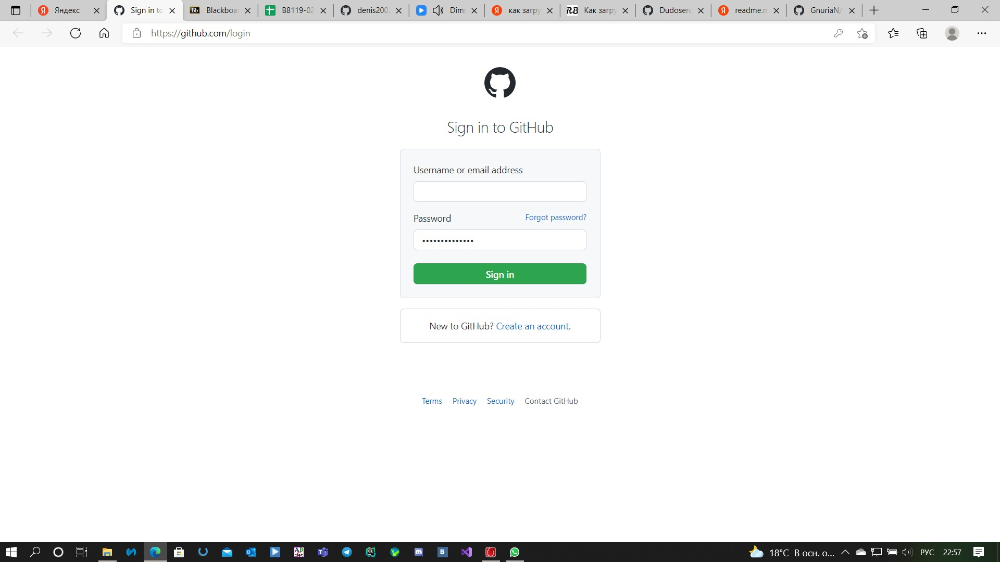
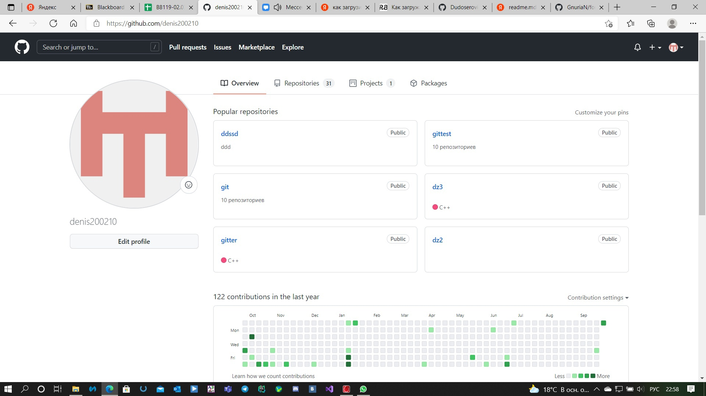
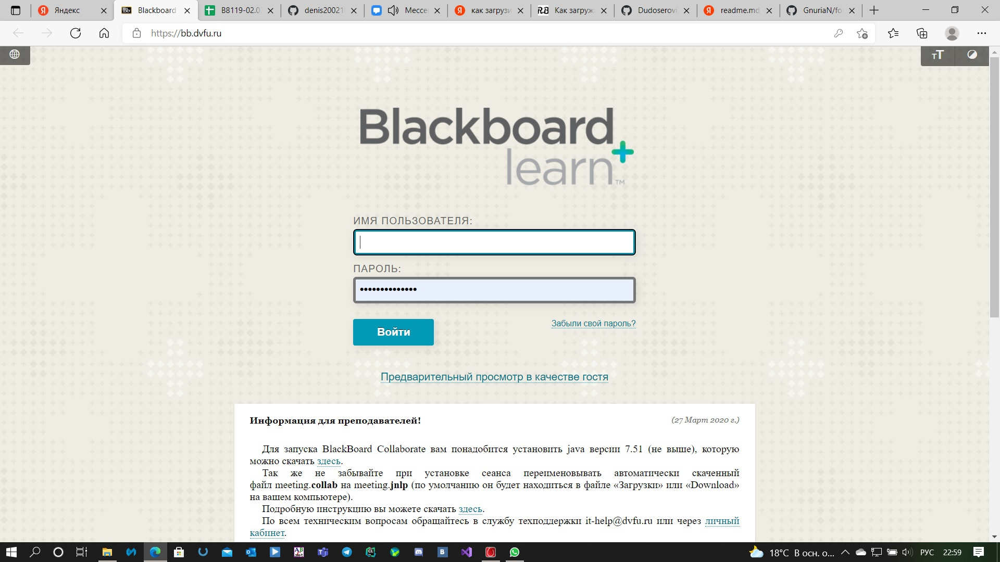
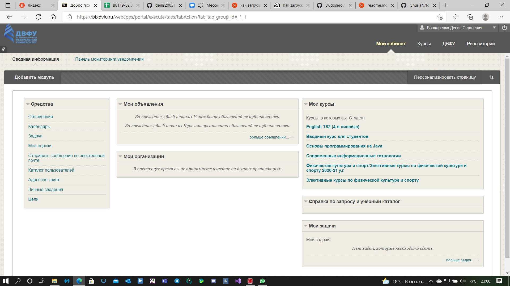

#  Написать эссе, в котором анализируется процесс аутентификации пользователей в двух произвольных web-ресурсах.

В настоящее время информационные системы (ИС) различного масштаба стали неотъемлемой частью базовой инфраструктуры государства, бизнеса, гражданского общества. Все больше защищаемой информации переносится в ИС. Современные информационные технологии не только обеспечивают новые возможности организации бизнеса, ведения государственной и общественной деятельности, но и создают значительные потребности в обеспечении безопасности для защиты информации.

Рассмотрим пару вариантов таких как:**Github** и **BlackBoard**

** :thumbsup:**

При переходе на страницу мы видим, что необходимо автоизироваться.

**:thumbsdown:**

===================
# Вывод :neutral_face:
